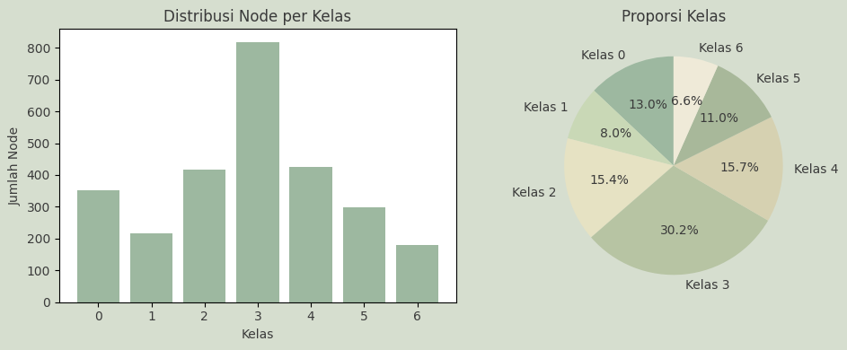
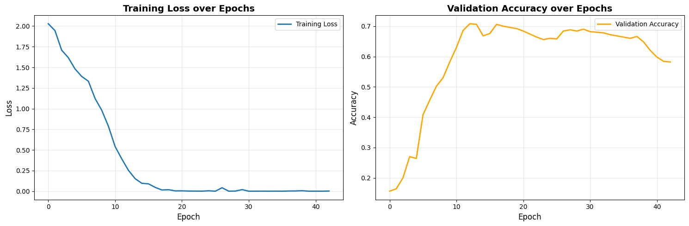

# Graph Finals – Custom GNN Message Passing on Cora

End-to-end **Graph Neural Network (GNN)** project for **semi-supervised node classification** on the **Cora citation network**, implemented using **PyTorch Geometric** with a **custom message passing mechanism**.

This repository represents the practical implementation corresponding to the final exam report for the *Graf Sains Data* course. The project emphasizes **conceptual correctness and architectural understanding** of GNNs rather than purely optimizing for state-of-the-art accuracy.

---

## Project Overview

The task is **node classification** on a citation graph:

- Nodes represent scientific papers
- Edges represent citation relationships
- Node features are sparse bag-of-words vectors
- Labels correspond to research topics

A **custom message passing GNN** is implemented, explicitly separating:
- Neighbor message transformation (`W_msg`)
- Self-node transformation (`W_self`)

This design ensures clarity in how structural and node-level information are combined.

---

## Team Members (Kelompok 4)

| No | Name | Student ID |
|----|------|------------|
| 1 | Devina Sawitri | 22031554036 |
| 2 | **Alivia Nayla Wibisono** | 22031554041 |
| 3 | Siti Aida Hanun | 22031554044 |
| 4 | Syarif Hidayatullah | 22031554046 |

**Program Studi**: S1 Sains Data  
**Mata Kuliah**: Graf Sains Data  
**Fakultas**: FMIPA, Universitas Negeri Surabaya  
**Tahun Akademik**: 2025/2026

---

## Dataset: Cora Citation Network

Loaded using `torch_geometric.datasets.Planetoid`.

### Dataset Statistics

| Component | Value |
|---------|------|
| Nodes | 2,708 papers |
| Edges | 10,556 citation links |
| Features | 1,433 (bag-of-words) |
| Classes | 7 research topics |
| Avg. Node Degree | 3.90 |
| Graph Density | 0.00144 (very sparse) |
| Feature Sparsity | >90% zeros |

### Data Splits

| Split | Nodes | Percentage |
|------|------|------------|
| Training | 140 | 5.2% |
| Validation | 500 | 18.5% |
| Test | 1,000 | 36.9% |
| Unlabeled | 1,068 | 39.4% |

---

## Class Distribution

The dataset exhibits **significant class imbalance**, with *Probabilistic Methods* as the dominant class and *Case Based* as the smallest. This imbalance contributes to bias toward majority classes during training.

---

## Model Architecture

A **3-layer Graph Neural Network (k = 3)** with custom message passing.

### Layer Configuration

| Layer | Channels |
|------|----------|
| Input | 1,433 |
| Hidden Layer 1 | 128 |
| Hidden Layer 2 | 64 |
| Hidden Layer 3 | 64 |
| Output | 7 classes |

### Regularization & Stabilization

- Dropout: **0.6**
- Batch Normalization (each layer)
- Residual (skip) connections
- L2 regularization (weight decay = 5e-4)

### Model Size

| Metric | Value |
|------|------|
| Trainable Parameters | 321,167 |
| Approx. Size | ~1.3 MB |

---

## 🔁 Custom Message Passing Mechanism

The model follows a **message–aggregate–update** paradigm:

$$
h_u^{(k)} = \sum_{v \in \mathcal{N}(u)} W_{\text{msg}} \cdot h_v^{(k-1)} + W_{\text{self}} \cdot h_u^{(k-1)}
$$

Where:
- `W_msg` transforms neighbor messages
- `W_self` preserves self-information
- Aggregation uses **sum**, ensuring permutation invariance

This formulation allows the model to jointly leverage **node features** and **graph structure**.

---

## Training Configuration

| Hyperparameter | Value |
|---------------|------|
| Optimizer | Adam |
| Learning Rate | 0.01 |
| Weight Decay | 5e-4 |
| Loss Function | NLLLoss |
| Activation | ReLU |
| Dropout | 0.6 |
| Epochs | 200 |
| Early Stopping Patience | 20 |
| Batch Size | Full graph |

Training is performed using **full-graph learning**, which is feasible due to the relatively small size of the Cora dataset.

---

## Training Loss

The training loss decreases smoothly and consistently, indicating stable optimization and successful fitting of the training data.

---

## Training Results

| Metric | Value |
|------|------|
| Training Accuracy | 100% |
| Validation Accuracy | 61.4% |
| Test Accuracy | **64.8%** |
| Train–Validation Gap | 38.6% |

The large train–validation gap indicates **overfitting**, despite the use of strong regularization techniques.

---

## Subgraph Sampling Analysis

A **2-hop neighborhood subgraph** was extracted around node **456** to analyze local graph structure.

Key observations:
- Approximately 70 nodes and 200+ edges
- Dense connectivity near the center node
- Mixed class labels (heterophily)
- Small-world–like structure

This analysis supports the use of **multi-layer (k > 1) message passing** to capture broader contextual information.
